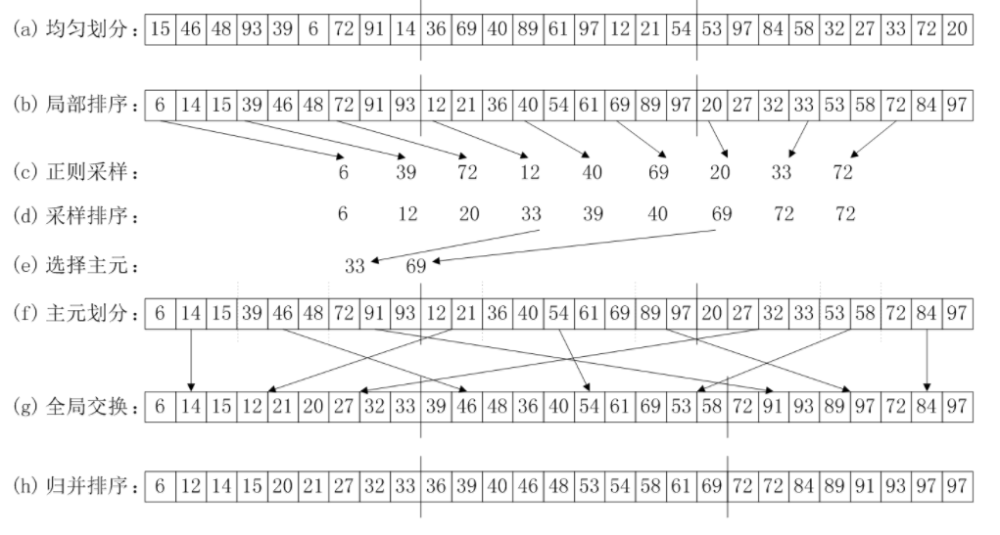
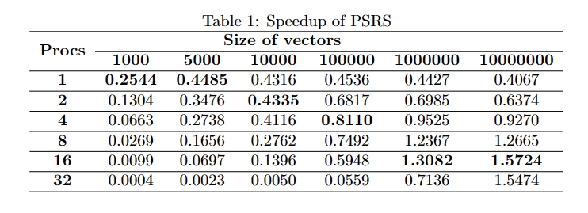
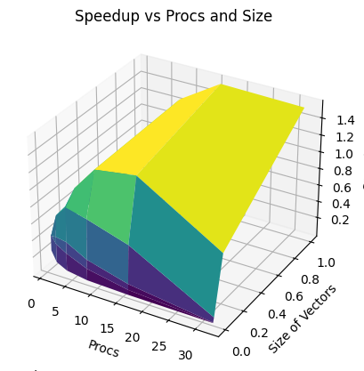

<font face="宋体">

&nbsp;
**<font size=12><p align="center">并行分布式计算</p></font>**
&nbsp;
<font size=6><p align="center">实验2 【MPI实现PSRS算法】 </p></font>
&nbsp;&nbsp;

<div align=center></div>

&nbsp;&nbsp;&nbsp;&nbsp;
<font size=5>

&nbsp;
<center>
学生姓名：<u>JeekZhang</u>
</center>

&nbsp;
<center>
学&ensp;号：<u>20307130xxx</u>
</center>

&nbsp;
<center>
专&ensp;业：<u>计算机科学与技术</u>
</center>

&nbsp;
<center>
学&ensp;&ensp;期：<u>2023年秋季学期</u>
</center>

</font>

<div STYLE="page-break-after: always;"></div>

<font size=5>一、实验目录：</font>

- 使用 mpi4py 实现 Parallel sorting by regular sampling 算法
- 测试程序的正确性以及在不同数据量以及在不同进程数情况下的加速比


<font size=5>二、实验环境：</font>

该实验在飞桨平台的CPU服务器环境（linux）下运行，配置如下：

| Component | Specification |
| --------- | ------------- |
| CPU Cores | 2             |
| RAM       | 8GB           |
| Disk      | 100GB         |


<font size=5>三、实验内容：</font>

#### 1. mpi4py的使用

​	类似于C中的原生MPI函数，mpi4py除MPI_Init和MPI_Finalize会自动调用外，其他的常用功能函数有如下的对应关系：
| MPI(C)  | mpi4py(Python) | Function |
| ------- | -------- |-------- |
| MPI_COMM_WORLD | COMM_WORLD             |通信域 |
| MPI_Comm_rank      | COMM_WORLD.Get_rank()         |获取当前进程号|
| MPI_Comm_size      | COMM_WORLD.Get_size()         |获取进程个数 |
| MPI_Send       | COMM_WORLD.send           |发送数据   |
| MPI_Recv       | COMM_WORLD.recv           |接收数据   |

#### 2. 正则采样排序思路与实现



(1) **均匀划分** ：将n个元素均匀划分为p段, 每个进程处理一段。在代码实现上，通过当前进程号和总的数组大小进行分区划分，当最后一组不能均匀划出时添加到前一组中，这一步在主进程（rank=0）中进行。
```python
    partition_size = length // size
    data = [random_array[i : i+partition_size] for i in range(0, (size-1) * partition_size, partition_size)]
    data.append(random_array[(size-1) * partition_size : length])
```

(2) **局部排序** : 每个进程对自己收到的部分数组进行串行排序算法。代码中需要用到`mpi_comm.scatter`进行数据分发，排序调用`sort()`即可，这一步在各个进程中完成。
```python
    data = mpi_comm.scatter(data, root=0)
    data.sort()
```

(3) **选取样本** : 从每个排序后的数组中均匀选取进程数个样本，集合到主进程中。
```python
    samples = [data[i] for i in range(0, len(data), max(len(data) // size, 1))][:size]
    samples = mpi_comm.gather(samples, root=0)

```

(4) **样本排序** : 在主进程中对收集到的样本进行排序。
```python
    samples_array = list(chain(*samples))
    samples_array.sort()
```

(5) **选择主元** : 在主进程中选择进程数-1个主元, 并播送给其他进程，将每个进程中的数组划分为进程数段。
```python
    pivots = [samples_array[i] for i in range(size, len(samples_array), size)][:size-1]
```

(6) **主元划分** : 每个进程按主元将有序段划分成进程数段，需要注意的是这里的主元是通过值进行传递，可通过bisect库进行二分查找每个主元的下标以便切割。
```python
    pivots = mpi_comm.bcast(pivots, root=0)
    cut_data = []
    start_index = 0
    for pivot in pivots:
        index = bisect.bisect_left(data, pivot, start_index)
        cut_data.append(data[start_index:index])
        start_index = index
    cut_data.append(data[start_index:])
```

(7) **全局交换** : 各进程将其有序段按段号交换到对应的进程中，这里可使用`mpi_comm.sendrecv()`来避免使用分开的`mpi_comm.send()`和`mpi_comm.recv()`函数造成死锁。
```python
    recv_data = [cut_data[rank]]
    for j in range(size):
        if j != rank:
            recv_data_part = mpi_comm.sendrecv(sendobj=cut_data[j], dest=j, source=j)
            recv_data.append(recv_data_part)
    recv_array = list(chain(*recv_data))
```

(8) **归并排序** : 各进程对接收到的元素进行归并排序（sort函数底层为插入加归并）, 按照段号顺序排列，排序后汇总到主进程将数组合成一维。
```python
    recv_array.sort()
    recv_array = mpi_comm.gather(recv_array, root=0)
    if rank == 0:
        array = list(chain(*recv_array))
```

#### 3. 正确性验证与加速比计算

​	为验证排序实现的正确性，我Copy了一份随机产生的数组并调用了`Python`中`sort`函数与PSRS结果进行对比。同时，测试程序将在100轮次、10M范围内的不同数据量（1K、5K、10K、100K、1M、10M）以及在不同进程数情况（1、2、4、8、16、32）下计算加速比。
​    经验证（测试结果输出“AC”），说明实现的排序结果与`sort`函数结果一致。  

​	并行加速比$（Speedup）= (\frac{T_1}{T_p})$，在代码实现上将分别测出相同数组在串行和并行的时间，前者为$T_1$，后者为$T_p$。测试结果和图表如下：



  根据数据和表格，可以得到以下的结论：  

**1、数据量和加速比的关系**   

​	与并行快排类似，二者存在一个非线性的关系，并不能说数据量越大，加速效果越好，加速比的极值在数据量中等区域出现。但跨过极值后，数据量增大，加速效果会有提升。但需要注意的是，这个极值随着进程数的增加会逐渐往后移。
​	通信开销、负载平衡等都是影响加速比的因素。由于涉及到主进程的额外处理操作，这可能导致一些进程处于空闲状态，从而限制了加速比的提升。

**2、进程数和加速比的关系**  

​	同样地，也是存在一个非线性的关系，并不是绝对的进程数越多，加速效果越好，而是进程数和数据量存在相匹配的关系：越大的进程数要与越大的数据量相匹配才能发挥最高的加速性能，未能匹配都会小于这个极值。  

​	这是因为进程数的增加并不总是导致线性的性能提升，而是与问题的规模和性质有关。在PSRS算法中，如果进程数过多，而数据规模较小，可能导致通信和同步开销增加，使得整体性能下降。反之，如果进程数不足以处理大规模数据，也不能充分发挥并行计算的优势。


#### 4. 改进方案设想

- 样本选择的改进：在样本选择时，可以使用更高效的算法而不是每次都选择相同的步长，可以考虑一些启发式方法。

- 串并行结合：类似于第一个Project，可以在数组较短时使用串行排序，数据量大时再使用并行。

- 归并排序：在实现上我没有采用严格的归并排序，而是为了简单做了数组合并后再排序，可以做若干排序数组归并的优化。

<font size=5>四、代码说明：</font>

编译运行
```bash
python run.py
```
`run.py`脚本将执行之前提到的共计36组实验（每组100轮次），实验结果将保存在out.log文件中。输出格式为procs length : Speedup AC(means sorted correctly)

<font size=5>参考&致谢</font>  

[1] https://mpi4py.readthedocs.io  

[2] https://github.com/jeekzhang/Awesome-Fudan  

[3] https://zhuanlan.zhihu.com/p/25332041   

[4] https://blog.csdn.net/wenzhang1216/article/details/126902883  

[5] https://aistudio.baidu.com  

[6] https://github.com/Row11n/ParallelComputingPJ

</font>