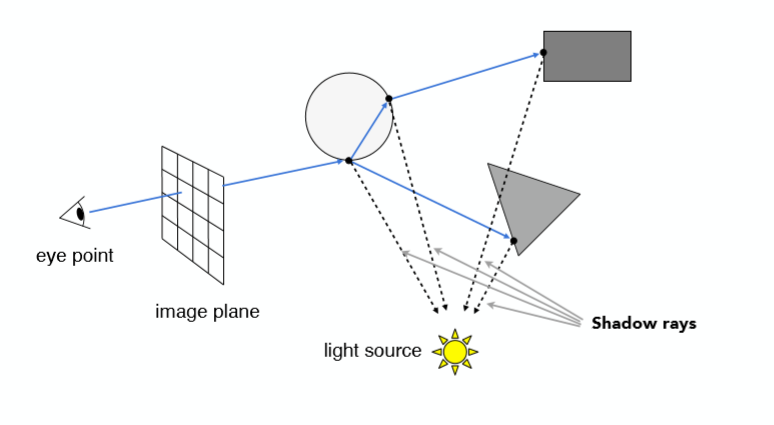
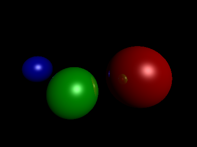
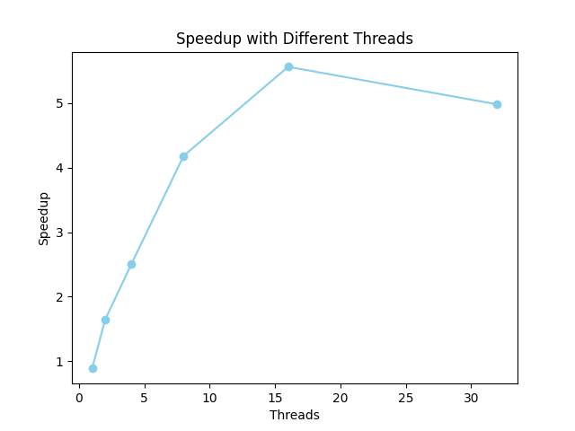

<font face="宋体">

&nbsp;
**<font size=12><p align="center">并行分布式计算</p></font>**
&nbsp;
<font size=6><p align="center">实验3 【并行光线追踪加速】 </p></font>
&nbsp;&nbsp;

<div align=center></div>

&nbsp;&nbsp;&nbsp;&nbsp;
<font size=5>

&nbsp;
<center>
学生姓名：<u>JeekZhang</u>
</center>

&nbsp;
<center>
学&ensp;号：<u>20307130xxx</u>
</center>

&nbsp;
<center>
专&ensp;业：<u>计算机科学与技术</u>
</center>

&nbsp;
<center>
学&ensp;&ensp;期：<u>2023年秋季学期</u>
</center>

</font>

<div STYLE="page-break-after: always;"></div>

<font size=5>一、实验目录：</font>

- python复现光线追踪算法
- 使用 MPI 加速光线追踪算法
- 测试程序在在不同进程数情况下的加速比
- 改进光线追踪算法，测试其加速比


<font size=5>二、实验环境：</font>

该实验在飞桨平台的CPU服务器环境（linux）下运行，配置如下：

| Component | Specification |
| --------- | ------------- |
| CPU Cores | 2             |
| RAM       | 8GB           |
| Disk      | 100GB         |


<font size=5>三、实验内容：</font>

#### 1. 光线追踪算法

- **基础原理**

    现实中我们看到的物体，是由来自各个方向入射光、反射光、折射光照亮而产生了颜色。光线的起点，是各种光源；光线的终点，则是用来接收的眼睛。在几何光学中，光路具有可逆性，如果我们从观察者的眼睛射出一道虚拟的光线，它经过的路径将与射入观察者眼睛的那道光路径完全一致，但方向相反。

    因此，为了做基于光线追踪的图像渲染，我们可以设置一个像素化的「窗口」，由每个像素发射一道虚拟光线，最终，这些光线都会回到光源中。再结合这些光的路径，和相关的物理/经验模型，我们可以计算出这个窗口上每一个像素点的颜色值，从而形成我们在计算机屏幕上看到的图像。


- **具体实现**
1. 场景设置：

   本次实验定义了三个球体，每个球体有球心位置、半径、颜色以及光照属性等信息，还定义了一个光源，属性包括位置、颜色和光照强度。

2. 相交测试：

   用于检测光线与球体的相交，返回光线与球体的交点距离。如果没有相交，则返回无穷大。确定相交后需要检测光线（射线）与物体的第一个交点，并基于交点坐标进行后续的光线反射、折射计算和颜色计算。

3. 光照模型：

   计算光线与场景中物体的交点的颜色，包括环境光、阴影、漫反射和镜面反射的计算。对于每个像素，通过遍历场景中的物体，找到与光线最近的交点，计算环境光的贡献。再进行阴影测试，检查交点是否在阴影中，如果是则不计算漫反射和镜面反射，否则就要考虑光源的位置和方向来进行计算。
   
4. 光线追踪

   追踪摄像机向每个像素点发射的光线路径，并对每个反射点进行颜色计算。反射是一个反复但会衰减的过程，可以递归来实现，每次反射，我们都将光线强度乘以反射系数，并在函数开始时判断当光线强度弱于0.01时结束递归。

5. 并行加速

   以上算法实际上是去计算图片每个像素点的颜色值，会进行H\*W的二层循环。我们要实现并行加速，一个简单的思路是，将H\*W的像素点计算划分为k份，分给k个进程，每个都将被给予场景的信息和像素颜色的计算方法，最后由主进程收集计算结果进行组合。需要注意的是，这里收集到的是整个图片的list，要进行最后图片的生成需要将结果进行合成。针对这个实验，只需要对每个像素做max-pooling，取有颜色的那个值就可以了。


#### 2. 并行部分代码实现

(1) **任务划分** ：将H*W个像素均匀划分为p段，每个进程处理一段。在代码实现上，为简便计算，只对行数进行划分，计算每个进程需要计算的`start_row`和`end_row`，最后一组接收最后的部分。

```python
chunk_size = h // size
start_row = rank * chunk_size
end_row = (rank + 1) * chunk_size if rank < size - 1 else h
```

(2) **分行处理** : 每个进程对自己收到的部分行进行光线追踪的像素计算，代码中只对这一部分调用`intersect_color`函数即可。
```python
for i, x in enumerate(np.linspace(S[0], S[2], w)):
    for j in range(start_row, end_row):
        y = np.linspace(S[1], S[3], h)[j]
        Q[:2] = (x, y)
        img[h - j - 1, i, :] = intersect_color(O, normalize(Q - O), 1)
```

(3) **收集组合** : 将计算完成后的img结果集合到主进程中，通过`np.maximum.reduce`进行max-pooling操作。
```python
result = comm.gather(img, root=0)
if rank == 0:
    final_img = np.maximum.reduce(result)

```
如果不做上述的max-pooling操作，程序会简单地将收到的每张图片拼接到一起，形如


#### 3. 渲染效果展示


$$
串行渲染效果
$$

$$
并行渲染效果
$$


#### 4. 加速比计算

​	测试程序将在10轮次的不同进程数情况（1、2、4、8、16、32）下计算加速比，测试脚本见`test.sh`。

​	并行加速比$（Speedup）= (\frac{T_1}{T_p})$，在代码实现上将分别测出相同场景在串行和并行的时间，前者为$T_1$，后者为$T_p$。测试结果和图表如下：

| Threads | Speedup    |
| ------- | ---------- |
| 1       | 0.8861     |
| 2       | 1.6453     |
| 4       | 2.5028     |
| 8       | 4.1824     |
| 16      | **5.5628** |
| 32      | 4.9811     |



  根据数据和表格，可以得到以下的结论：  

**1、并行损耗**  

​	从图表中可以明显看到，并行计算无法实现理论上的加速比为1，并行计算所带来的优势未能充分发挥。这其中的主要原因之一是通信开销，即使没有其他的线程，还是会进行这一步操作，导致性能损耗。另一个主要因素是同步操作，比如在最后一步主进程的收集，主进程需要等待其他进程完成像素点计算任务，同时，其他率先完成的进程也无法代替主进程来完成这一任务。

**2、进程数和加速比的关系**  

​	类似于前面做的两个实验，这其中也是存在一个非线性的关系，并不是绝对的进程数越多，加速效果越好，而是进程数和具体任务存在相匹配的关系：一个直观的理解是当划分的线程数比行数还大就没有必要了。 


<font size=5>四、代码说明：</font>

编译运行
```bash
python run.py
```
`run.py`脚本将执行之前提到的串行、并行（1+6）共计7组实验（每组10轮次），实验结果将保存在out.log文件中。输出格式为


<font size=5>参考&致谢</font>  

[1] https://mpi4py.readthedocs.io  

[2] https://github.com/jeekzhang/Graphics-project/tree/Ray-casting-tracing  

[3] https://zhuanlan.zhihu.com/p/361144314   

[4] https://numpy.org/doc/stable/reference/generated/numpy.maximum.html  

[5] https://aistudio.baidu.com  

</font>

