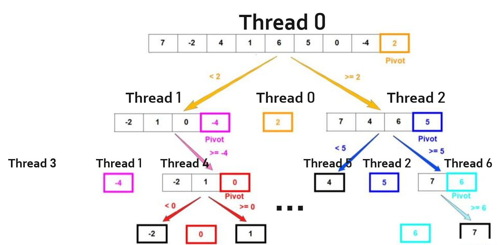
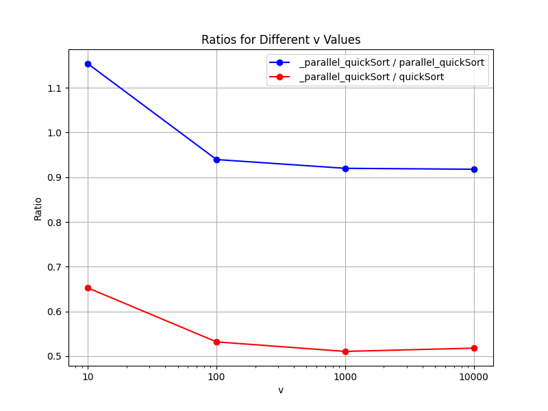
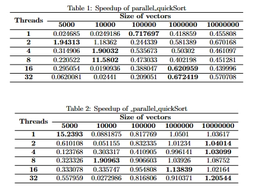

<font face="宋体">

&nbsp;
**<font size=12><p align="center">并行分布式计算</p></font>**
&nbsp;
<font size=6><p align="center">实验1 【OpenMP编程实现并行快排】 </p></font>
&nbsp;&nbsp;

<div align=center></div>

&nbsp;&nbsp;&nbsp;&nbsp;
<font size=5>

&nbsp;
<center>
学生姓名：<u>JeekZhang</u>
</center>

&nbsp;
<center>
学&ensp;号：<u>20307130xxx</u>
</center>

&nbsp;
<center>
专&ensp;业：<u>计算机科学与技术</u>
</center>

&nbsp;
<center>
学&ensp;&ensp;期：<u>2023年秋季学期</u>
</center>

</font>

<div STYLE="page-break-after: always;"></div>

<font size=5>一、实验目录：</font>

- 复现串行排序算法baseline（含partition函数实现）
- 使用 OpenMP 编程实现并行快速排序算法
- 测试串行与并行程序以及封装排序函数的差异
- 针对测试将串行和并行排序进行trade-off并改进
- 计算在不同数据量以及在不同线程数情况下的加速比


<font size=5>二、实验环境：</font>

该实验在飞桨平台的CPU服务器环境（linux）下运行，配置如下：

| Component | Specification |
| --------- | ------------- |
| CPU Cores | 2             |
| RAM       | 8GB           |
| Disk      | 100GB         |


<font size=5>三、实验内容：</font>

#### 1. 复现串行排序算法

​	为更好地进行并行代码的书写，尤其是partition函数的实现，我先对串行排序算法进行了实现：

（1）**partition函数**：传统的partition函数利用指针不断地交换左右两边的数，使得比start大的移至右边，比start小的移至左边；此处的partition函数参考了《算法导论》中改进版的快速排序（Balanced partitioning），即随机地选取划分元素。在代码实现上，我随机地从start到end中选取元素与start位置元素进行交换，后续代码保持不变。

```c++
int partition(vector<int>& arr, int start, int end) {
    int select = rand() % (end - start + 1) + start;
    swap(arr[select], arr[start]);
    int left = start, right = end;
    int tmp = arr[left];
    while (left < right) {
        while (left < right && arr[right] >= tmp) {
            right--;
        }
        arr[left] = arr[right];
        while (left < right && arr[left] < tmp) {
            left++;
        }
        arr[right] = arr[left];
    }
    arr[left] = tmp;
    return left;
}
```

（2）**串行排序**：得到partition后，只需调用它并获得划分元素的下标，分治递归地执行左右两部分即可。

```c++
void quickSort(vector<int>& arr, int start, int end) {
    if (start < end) {
        int p = partition(arr, start, end);
        quickSort(arr, start, p - 1);
        quickSort(arr, p + 1, end);
    }
}
```


#### 2. 使用 OpenMP 编程实现并行快速排序算法

（1）**并行实现**：根据课上所学，上面实现的串行排序可以在分治递归地执行左右两部分时进行并行操作。



​	在代码层面，通过OpenMP的并行编程接口，首先由主线程通过partition函数得到左右两个部分，左右两部分在通过两个子线程进行快速排序操作，如此递归下去。

（2）**OpenMP编程**：

​	使用OpenMP中的sections分段执行逻辑实现划分并行，格式形如：

```c++
#pragma omp parallel sections
{
    #pragma omp section
    section(1);
    #pragma omp section
    section(2);
}
```

实例如下：

```c++
void parallel_quickSort(vector<int>& arr, int start, int end)
{
    if (start < end) {
        int p = partition(arr, start, end);
        #pragma omp parallel sections
        {
            #pragma omp section
            parallel_quickSort(arr, start, p - 1);
            #pragma omp section
            parallel_quickSort(arr, p + 1, end);
        }
    }
}
```


#### 3. 测试比较与正确性验证

​	为验证排序实现的正确性，我调用了`C++`中`algorithm`库函数`sort`（内部也是快排实现）与串行、并行排序结果进行对比。同时，我测试了在（4个threads、1K轮次、1M范围、0.1M ~ 1M长度的数据）的随机条件下不同数组，三种排序的不同用时。

| Algorithm            | Execution Time (ms) | Speed (times) |
| -------------------- | ------------------- | ------------- |
| sort                 | 1857.19             | 1.26          |
| quickSort (baseline) | 1470.81             | 1             |
| parallel_quickSort   | 4907.46             | 3.37          |

​	且经验证，实现的两种排序结果与`sort`函数结果一致。

​	比较意外的有两点：

- 自己手撕的快竟然会比`sort`函数还快；
- 并行的`parallel_quickSort`比串行`quickSort`还慢，这可能是因为在较小的数组下依然采用并行，开线程和通信的开销大于了真正排序的开销。为验证这一猜想，我将在下一部分进行相应的改进。


#### 4. 并行排序改进

​	根据猜想，改进应该只需要在并行排序执行前加一个判断，如果排序长度小于某个值就执行串行排序。改进后的实现如下：

```c++
void parallel_quickSort(vector<int>& arr, int start, int end)
{
    if (end - start < 1000) quickSort(arr, start, end);
    else if (start < end) {
        int p = partition(arr, start, end);
        #pragma omp parallel sections
        {
            #pragma omp section
            parallel_quickSort(arr, start, p - 1);
            #pragma omp section
            parallel_quickSort(arr, p + 1, end);
        }
    }
}
```

​	在此处我设置的临界值为1000，但实际不一定是这个结果，因此下面我将对一系列临界值在（2~8个threads、1K轮次、1M范围、10K~1M长度的数据）的随机条件进行测试，以$10^n$（10~10K）为测试样例。结果见下表（_parallel_quickSort为改进版）：

| **v** | **_parallel_quickSort (s)** | **quickSort (s)** | **parallel_quickSort (s)** |
| ----- | --------------------------- | ----------------- | -------------------------- |
| 10    | 164.907                     | 142.911           | 252.693                    |
| 100   | 135.361                     | 144.060           | 254.496                    |
| 1000  | 131.190                     | 143.196           | 258.027                    |
| 10000 | 132.741                     | 144.615           | 256.307                    |



​	因为我在线程选取上扩大了上限，因而parallel_quickSort会变得比以前略快一些，但还是慢于串行。由于数据的随机性，我将相对值作为比较的重点，从图中可以看出：v=1000确实是较好的一个取值，故在后续的加速比计算上，采用v=1000作为最后的测量函数。


#### 5. 加速比计算

​	在具体实验上，测试程序将在（10K轮次、10M范围）的不同数据量（5K、10K、100K、1M、10M等）以及在不同线程数情况（1、2、4、8、16、32）下计算纯并行（parallel_quickSort）和串并行结合（_parallel_quickSort）的加速比。

​	并行加速比$（Speedup）= (\frac{T_1}{T_p})$，在代码实现上将分别测出相同数组在串行和并行的时间，前者为$T_1$，后者为$T_p$。



​	根据数据和表格，可以得到以下的结论：
**1、数据量和加速比的关系** 
​	存在一个非线性的关系，并不能说数据量越大，加速效果越好，加速比的极值在数据量中等区域出现。但跨过极值后，数据量增大，加速效果会有提升。

​	其中一个主要因素是通信和同步开销。当数据量较小时，通信和同步的开销可能会超过并行计算所带来的性能提升，因此并行计算的加速比可能不如预期。当数据量逐渐增大时，通信和同步的开销相对于整体计算的时间变得较小，因此并行计算的加速比开始提高。然而，当数据量进一步增大时，由于计算规模较大，可能会出现一些性能瓶颈，例如内存带宽不足、CPU计算能力不足等，这些因素可能限制了并行计算的性能提升，导致加速比达到极值。当超过这个极值后，随着数据量的增大，系统可能会采用更多的计算资源，例如更多的CPU核心、更大的内存等，从而进一步提高并行计算的性能，导致加速比再次上升。

**2、线程数和加速比的关系**
	也是存在一个非线性的关系，并不是绝对的线程数越多，加速效果越好，而是线程数和数据量存在相匹配的关系：越大的线程数要与越大的数据量相匹配才能发挥最高的加速性能，未能匹配都会小于这个极值。

​	当线程数过少时，可能无法充分利用系统的计算资源，导致性能瓶颈。当线程数适中时，可以充分利用系统资源，加速比逐渐提高。但是，当线程数增加到一定程度时，额外的开销可能会超过并行计算带来的性能提升，从而导致加速比不再增加，甚至可能下降。

**3、串并行结合的影响**
	我设置的临界值为1K，可以发现这样做相当于延后了加速比极值的出现，且平均性能较纯并行的结果有较大提升。因此，延后并行计算的开始，只有在数据量较大时才使用并行排序，可以有效地避免在小规模数据上发生性能下降，同时在大规模数据上充分发挥并行计算的优势。这样就使得整体的性能曲线相对平滑，避免了在某个特定数据量下发生性能急剧下降的情况，进而获得了较为稳定的性能提升。


<font size=5>四、代码说明：</font>

编译运行
```bash
g++ -fopenmp main.cpp -o main
./main
```
不同任务运行

```c++
int main() {
    srand(3407);
    comp_eaxm();	//测试比较与正确性验证
    findV();	    //寻找串并行临界值
    speedup();		//计算加速比
    return 0;
}

//在speedup()中，需根据需求通过注释的方式选择执行纯并行还是串并行结合
    // parallel_quickSort(arr, 0, len[i]-1);
    _parallel_quickSort(arr, 0, len[i]-1, 1000);
```


<font size=5>参考&致谢</font>
[1] H.Cormen T ,E.Leiserson C ,L.Rivest R , et al.算法导论(原书第3版)[J].计算机教育,2013(12):18.DOI:10.16512/j.cnki.jsjjy.2013.12.029.  
[2] https://github.com/jeekzhang/Awesome-Fudan  
[3] https://blog.csdn.net/sxj731533730/article/details/118248395  
[4] https://blog.csdn.net/qq_45769678/article/details/118711856  
[5] https://aistudio.baidu.com  

</font>
